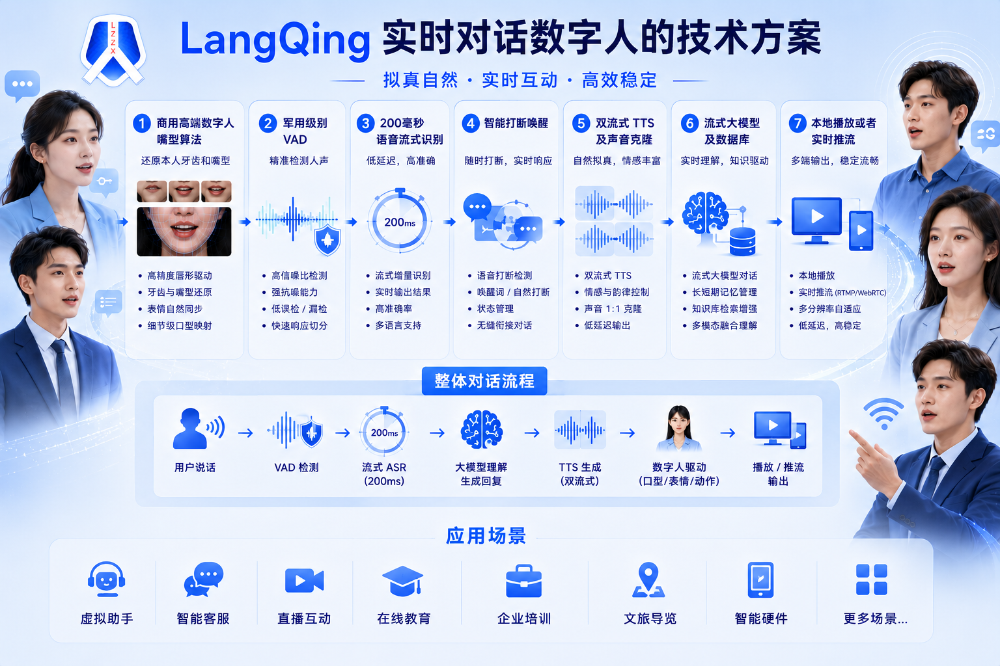

# LangQing
# LangQing is a realtime interactive digital human platform developed by LangZiZhiXin Technology. 
# 一个可以超保真还原本人牙齿和嘴型的商用定制实时数字人项目。
## 🏗️ LangQing realtime interactive digital human

  <b>
    <a href="https://www.bilibili.com/video/BV1sbRKBFECa/?spm_id_from=333.1387.upload.video_card.click&vd_source=7720ff9e037156b51374d14ee8f76b51">Video </a>
    |     
    <a href="https://github.com/langzizhixin">Project Page</a>
    |
    <a href="https://github.com/langzizhixin/LangQing">Code</a> 
  </b>

 

## 📊 Project Poster

  
    
  
## 📊 Application Scenarios

  
    
  
## 📊 Technical Solution

  
    

# Advantages
1. Only act when speaking, with semantic coordination.
2. It can switch videos seamlessly without any flickering.
3. Commercial algorithms can achieve a similarity of over 96% between teeth and mouth shapes.
4. It can provide an extremely fast response within 500 milliseconds, compared to the average response time of around 1.5 seconds.
5. Support the integration of various intelligent agents.
6. Supports 2D, 2.5D, and 3D.
7. Supports super concurrency. The 3060, priced at over 1000 yuan, supports 4 to 6 concurrent paths.
8. Support cloud deployment, local deployment, and information technology innovation transformation.
9. Support performances such as singing, dancing, and changing clothes.
10. Supports RAG, workflow, and agent orchestration.
11. Low latency and high synchronization, ensuring high synchronization between audio and video lip shape, action, and voice.
12. Supports multiple languages and switching between multiple models.
13. Highly robust automatic speech recognition (ASR) + text-to-speech (TTS).
14. Develop long-term contextual memory ability.
15. It features personalized customization functions.
16. Compliance and Security: Support for private deployment and data isolation to ensure security and reliability.
17. Support seamless integration with mainstream large models.

Wait, these are nationally leading commercial technologies, with no equivalent competing products in China, and currently only second to HeyGen in the United States.

# Features
- Ultra low latency realtime interaction (<500ms fast response)
- Natural gesture generation driven by speech semantics
- Seamless video switching without flickering
- High lip-sync accuracy (up to 96% similarity)
- WebRTC realtime streaming
- GPU realtime inference
- Multi-agent integration
- RAG and workflow orchestration
- Singing, dancing and costume changing
- 2D / 2.5D / 3D digital humans
- Human / anime / animal  support
- Cloud deployment and on-premise deployment
- XinChuang compatibility support
- Multi-language support
- Long-context memory
- Persona customization
- High concurrency deployment

## 🎬 Demo

<table class="center">
  <tr style="font-weight: bolder;text-align:center;">
        <td width="100%"><b>Original video</b></td>
        <td width="50%"><b>Lip-synced video</b></td>
  
    <td width=1920px>
      <video src=https://github.com/user-attachments/assets/33308041-5990-4f3f-9479-95b87907a575 controls preload></video>
    </td>
    
    <td width=1920px>
      <video src=https://github.com/user-attachments/assets/31622741-077e-45f8-a01e-785d89f1113b controls preload></video>
    </td>
  </tr>
  <tr>
</table>

## 📑 Open-source Plan
For digital human projects , we will continue to train and release higher definition weights in the future.
The plan is as follows:
Pre training checkpoints for wav2lip_288x288 (LangXin_V0) will be released in January 2025.
Pre training checkpoints for wav2lip_384x384 (LangXin_V1) will be released in February 2025.
Pre training checkpoints for IP_LAP_256 (LangXin_V2) will be released after June 2025.
Pre training checkpoints for  (LangXin_V3) will be released after June 2026.
- [x] landmark_checkpoints  
- [x] renderer_checkpionts
- [x] Dataset processing pipeline
- [x] Training method
- [x] Inference
- [ ] Real time Inference 
- [ ] Higher definition commercial checkpoints

## 🙏  Citing
Thank you to the other three authors, Thank you for their wonderful work.
https://github.com/Weizhi-Zhong/IP_LAP

## 📖 Disclaimers
This repositories made by langzizhixin from Langzizhixin Technology company 2025.7.20 , in Chengdu, China .
The above code and weights can only be used for personal/research/non-commercial purposes.
Especially for digital human video models in the warehouse, if commercial use is required, please contact the model themselves for authorization.
If you need a higher definition model, please contact us by email 277504483@qq.com, ajian.justdoit@gmail.com or add ours WeChat for communication: langzizhixinkeji 
